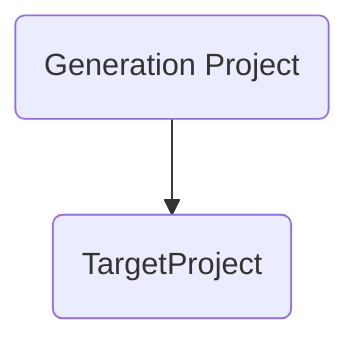
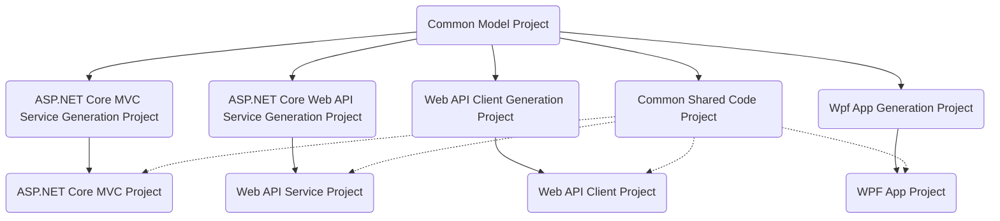
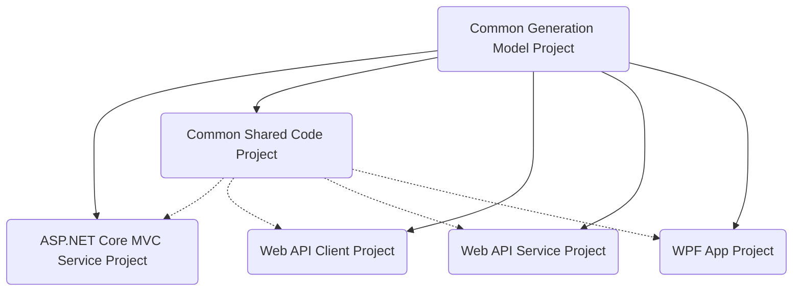

# Nucleotide

## Mission Statement

To provide a tool that automatically generates repeditive .NET code to allow better use of developers time.

## Introduction

Nucleotide is a library to aid in the generation of .NET code for manipulation the following types of objects:

* Client\Server Services (Interfaces)
* Commands (Classes)
* Command Factory (Interfaces and Classes)
* Entity Framework DbSet (Classes)
* Entity Framework Models (Classes)
* Entity Framework Entity Type Configuration (Classes)
* Entity Framework Parent and Child Foreign Keys Representation (Interfaces)
* Models (Interfaces and Classes)
* MVC Controllers (Classes)
* Queries (Classes)
* Query Factories (Interfaces and Classes)
* Request DTO POCO Objects (Classes)
* Response DTO POCO Objects (Classes)
* SignalR Hubs (Classes)
* WCF Service classes (Classes)
* Web Api Client (Classes)
* Web Api Controllers (Classes)

This project leverages Roslyn functionality to combine a DSL style model with the power of the compiler to give a simple way to generate code.

## Credits

* https://github.com/AArnott/CodeGeneration.Roslyn : Allowed the original migration away from T4 to Roslyn

## Getting Started

### Pre-requisites

You will need:
* An IDE \ Build chain that supports Roslyn (Recent versions of VSCode, Visual Studio, Jetbrains Rider, etc.)
* A project using
  * A supported version of .NET core (Version 8)
  * C# 9 language compiler settings or later

### Before you start

You can use the following project structure

* Your generation model sits in a project above the project where it will be generated

* You can also have a common model, then sub projects used to generate specific code

NOTE: There is an intention to simplify this use case to reduce the number of proxy projects.

2. Your code generation model is in Project1, while your generated code is in Project2.

### Get the package (Single Project)

You want to install Nucleotide in the project where you want to place your generated model.

` Install-Package Dhgms.Nucleotide `

### Get the package (Dual Project)

**In project1.**

1. ` Install-Package Dhgms.Nucleotide `

1. Add Your Code Generation Models

1. Inherit the Code Generation Attributes.

**In project2.**

1. Reference Project1.

1. ` Install-Package Dhgms.Nucleotide `

1. Apply the Assembly Code Generation Attributes.

### Get started with a Code Generation Model

TODO.

### Apply a Model Generation Attribute

TODO.

## Viewing the documentation

The documentation can be found at http://dpvreony.github.io/nucleotide/

## Contributing to the code

See the [contribution guidelines](CONTRIBUTING.md).
